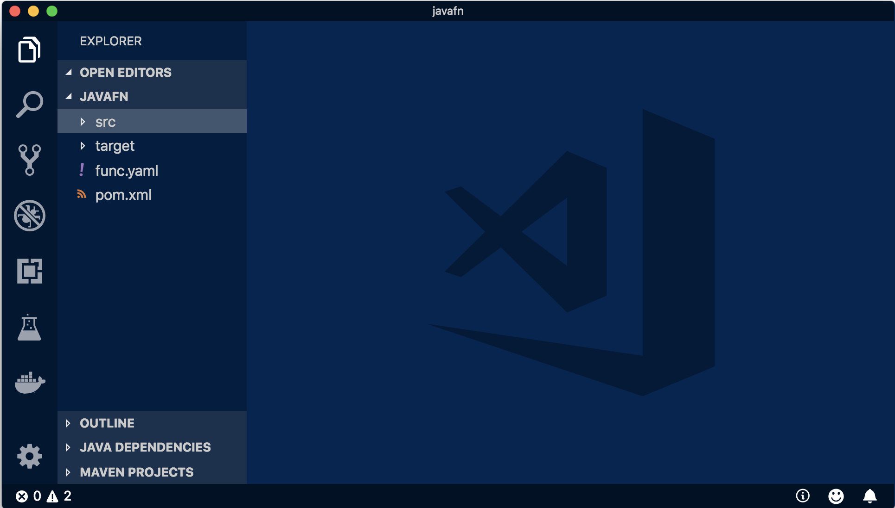
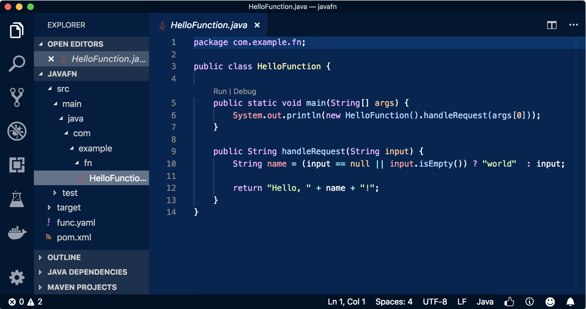
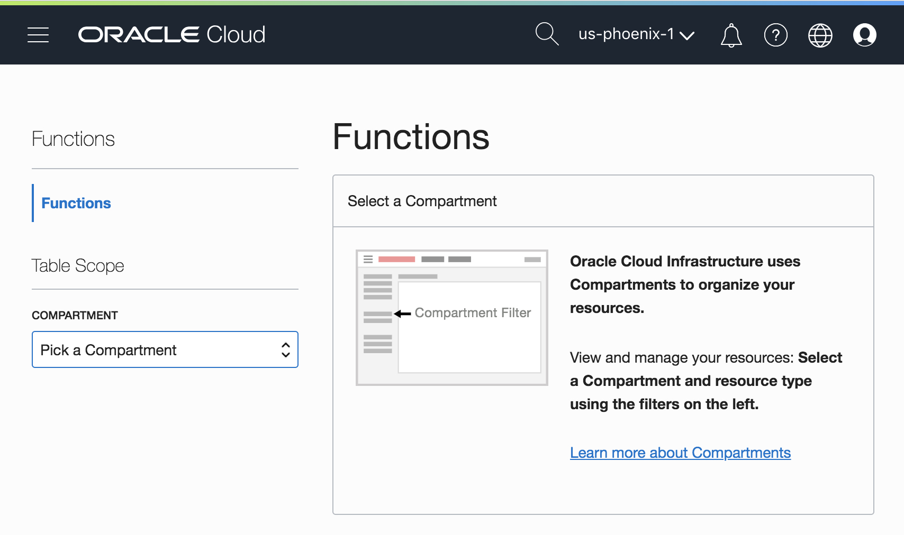
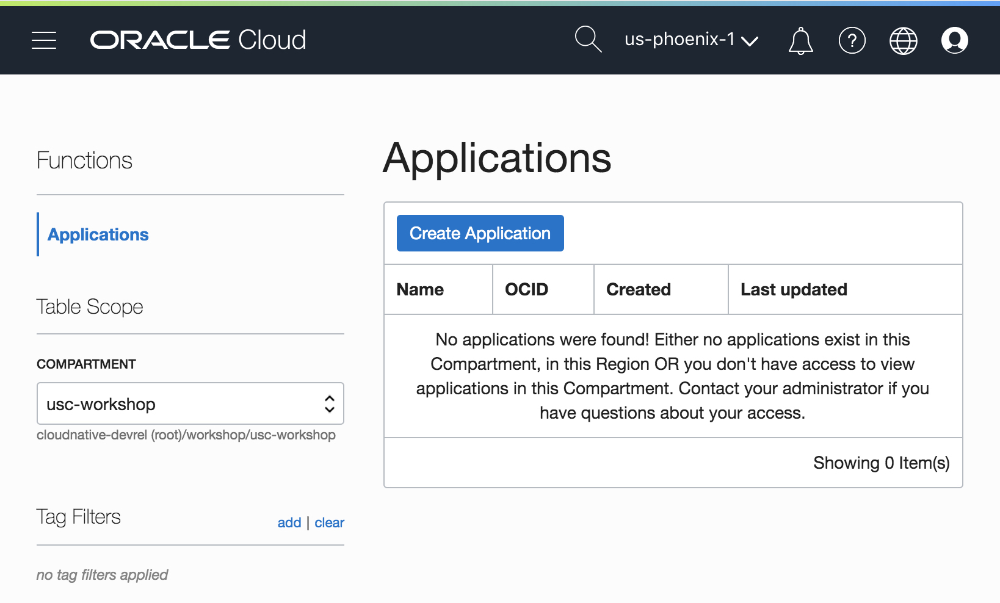
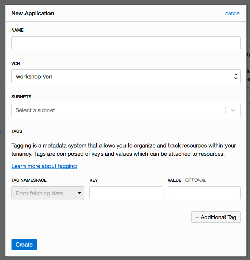
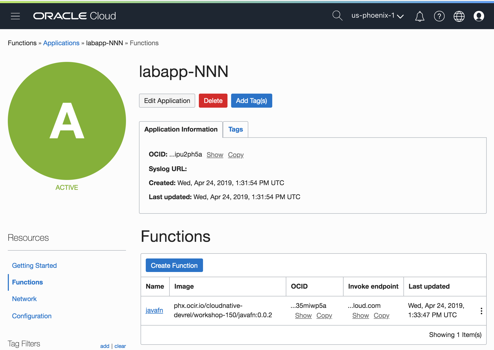

# Your First Function with Java

In this introductory lab we'll walk through developing a function using the Java
programming language--without installing any Java tools! We'll see how easy it
is to build, deploy and test functions written in Java.

> As you make your way through this lab, look out for this icon.
 Whenever you see it, it's time for you to
perform an action.

Let's start with a very simple "hello world" function written in Java. Don't
worry, you don't actually need to know Java but it'll definitely be helpful!
When working with Oracle Functions you don't even need to have Java installed on
your development machine as Fn provides the necessary Java tools as a Docker
container.  Let's walk through your first function to become familiar with the
process and how Fn supports development.


### Create your Function
In the terminal type the following.


>```
>fn init --runtime java javafn
>```

The output will be:

```sh
Creating function at: /javafn
Function boilerplate generated.
func.yaml created.
```

The `fn init` command creates a simple function with a bit of boilerplate to get
you started. The `--runtime` option is used to indicate that the function we're
going to develop will be written in Java. A number of other runtimes are also
supported.  Fn creates the simple function along with several supporting files
in the `javafn` directory.  By default, the name of the folder matches the
function name.

### Review your Function File

With your function created, change into the `/javafn` directory.


>```
> cd javafn
>```

Now get a list of the directory contents.


>```
> ls
>```

```sh
func.yaml  pom.xml    src/
```

The `fn init` command generates a simple function and a JUnit test in `src`
along with a Maven build defined in the `pom.xml` file. The `func.yaml` contains
metadata about the function.

The Visual Studio Code IDE is included in your development environment so we
can open the function in the current folder by typing:


>```sh
> code . 
>```

If VSCode opens a "welcome" web page just close it and return to the IDE.



 In the left hand pane, navigate down to 
`HelloFunction.java` and open it.



The `handleRequest` method implements the function which takes a single string
as input. If this method is passed in the string "Bob" it'll return "Hello Bob".
If no input is provided, the function returns "Hello World" by default.

If you're familiar with building web apps or microservices using popular
frameworks you'll note the complete absence of anything but function code.  One
of the great benefits of serverless functions is that it let's you focus on your
code and not on dealing with HTTP requests.  

### Understanding func.yaml

The `fn init` command also generated a `func.yaml` function
configuration file. Let's look at the contents:

 In the left hand pane, click on `func.yaml`.


The generated `func.yaml` file contains metadata about your function and
declares a number of properties including:

* schema_version--identifies the version of the schema for this function file.
  Essentially, it determines which fields are present in `func.yaml`.
* name--the name of the function (which matches the directory name by default)
* version--automatically starting at 0.0.1.
* runtime--the name of the runtime/language which was set based on the value set
  in `--runtime`.
* build_image--the Docker image used to build your function
* run_image--the Docker image your function runs in
* cmd--the name of the Java class and method to invoke when your function
  is called.  It can be anything but in this case it's
  `com.example.fn.HelloFunction::handleRequest`.

There are other user specifiable properties but these will suffice for this
example.  Note that if not specified, the name of your function will be taken
from the containing folder name.

## Your Deployment Target

With the `javafn` directory containing `pom.xml` and `func.yaml` you've got
everything you need to deploy the function. Make sure your context is set to
point to Oracle Functions. Use the `fn list context` command to check.


>```sh
> fn list contexts
>```

The `API URL` and `REGISTRY` values of the `*`'d row should be pointing to Oracle
Functions and OCIR, respectively:

```shell
CURRENT    NAME        PROVIDER    API URL                                           REGISTRY
           default     default                                                       shsmith
*          workshop    oracle      https://functions.us-phoenix-1.oraclecloud.com    phx.ocir.io/cloudnative-devrel/shsmith
```

### Creating an Application

Before you can deploy a function you'll need to create an application.  You can
do this using the `fn` CLI or in the Oracle Functions console.  We'll use the
console as it's somewhat simpler to select options from drop down menus than
to copy/paste network values into the command line.

Point your browser to the Oracle Functions console:

https://console.us-ashburn-1.oraclecloud.com/functions/

You logged in earlier so the page should just open.



 Select the "**us-phoenix-1**" region from
   the drop down at the top of the page. Oracle Functions is currently only
   available in the Phoenix data center.


 Select the "**usc-workshop**" compartment
   from the drop down on the lower left of the page.  The `usc-workshop` is
   nested inside  `cloudnative-devrel` and `workshop` compartments so you'll
   have to navigate down to select it.


Once you've made these selections you should see a list of function Applications.



 click "Create Application" and complete the
form with the following values where NNN is your lab participant number.  

**IMPORTANT NOTE**: Lab participants are all working in the same OCI tenancy and
compartment so to avoid confusion you need to name your applications with your
participant number. Wherever you see `NNN` in the lab instructions please
substitute in your number.

>```sh
> name: `labapp-NNN`
> vcn: `usc-workshop-vcn`
> subnet: `Public Subnet nFuS:PHX-AD-1`
>```



Functions deployed as part of this application will be attached to the
specifiied vcn and subnet.

 click "Create" to finish.

## Deploying your First Function

With the Application created, you're now ready to add functions to it. Deploying
your function is how you publish your function and make it accessible to other
users and systems. To see the details of what is happening during a function
deploy,  use the `-v / --verbose` switch.  The first time you build a function
of a particular language it takes longer as the `fn` CLI downloads the necessary
Docker images. The `--verbose` option allows you to see this process.

### Building and Deploying your Function

The `fn` CLI makes it easy to build and deploy functions.  Building a function
is the process of compiling (if necessary) and packaging your code into a Docker
container.  The deployment step will push the container to the Oracle Cloud
Infrastructure (Docker) Registry (OCIR) and define the function in Oracle
Functions.  You can do all of this in one command.


>```sh
> fn --v deploy --app labapp-NNN
>```

When we deploy a single function we have to specify the application it belongs
to.

You should see output similar to:

```yaml
Deploying javafn to app: labapp-NNN
Bumped to version 0.0.2
Building image shsmith/javafn:0.0.2
FN_REGISTRY:  shsmith
Current Context:  default
Sending build context to Docker daemon  14.34kB
Step 1/11 : FROM fnproject/fn-java-fdk-build:jdk9-1.0.83 as build-stage
jdk9-1.0.83: Pulling from fnproject/fn-java-fdk-build
c2ad77de49ce: Already exists 
d6485a2cca95: Already exists 
4f4ea4e6ab41: Already exists 
649f9534d72b: Already exists 
6e47a95e0938: Already exists 
d46a954202a9: Pull complete 
5a73fd16c382: Pull complete 
6028b8203fcc: Pull complete 
98a6eaf5f83b: Pull complete 
7afb9733d3e4: Pull complete 
107a8e7e5bd9: Pull complete 
384cc00c5a4f: Pull complete 
bb19e03dd551: Pull complete 
b7f4aa3f1f42: Pull complete 
Digest: sha256:5be1aff1f7107b8a1a50e4b906b91fc6487977a9e70639e6133cdaaa8b58d74d
Status: Downloaded newer image for fnproject/fn-java-fdk-build:jdk9-1.0.83
 ---> 10c10a1cd2ae
Step 2/11 : WORKDIR /function
 ---> Running in 68884bc0f125
Removing intermediate container 68884bc0f125
 ---> 44432a740323
Step 3/11 : ENV MAVEN_OPTS -Dhttp.proxyHost= -Dhttp.proxyPort= -Dhttps.proxyHost= -Dhttps.proxyPort= -Dhttp.nonProxyHosts= -Dmaven.repo.local=/usr/share/maven/ref/repository
 ---> Running in b6f5256bc328
Removing intermediate container b6f5256bc328
 ---> 401d12925a1f
Step 4/11 : ADD pom.xml /function/pom.xml
 ---> 92803f3eba9d
Step 5/11 : RUN ["mvn", "package", "dependency:copy-dependencies", "-DincludeScope=runtime", "-DskipTests=true", "-Dmdep.prependGroupId=true", "-DoutputDirectory=target", "--fail-never"]
 ---> Running in 13af70800045
[INFO] Scanning for projects...
Downloading from central: https://repo.maven.apache.org/maven2/org/apache/maven/plugins/maven-compiler-plugin/3.3/maven-compiler-plugin-3.3.pom
...more maven downloads here, removed for brevity...

[INFO] 
[INFO] ------------------------< com.example.fn:hello >------------------------
[INFO] Building hello 1.0.0
[INFO] --------------------------------[ jar ]---------------------------------
Downloading from fn-release-repo: https://dl.bintray.com/fnproject/fnproject/com/fnproject/fn/api/1.0.83/api-1.0.83.pom
...more maven downloads here, removed for brevity...

[INFO] 
[INFO] --- maven-resources-plugin:2.6:resources (default-resources) @ hello ---
[INFO] Using 'UTF-8' encoding to copy filtered resources.
[INFO] skip non existing resourceDirectory /function/src/main/resources
[INFO] 
[INFO] --- maven-compiler-plugin:3.3:compile (default-compile) @ hello ---
Downloading from central: https://repo.maven.apache.org/maven2/org/apache/maven/maven-toolchain/2.2.1/maven-toolchain-2.2.1.pom
...more maven downloads here, removed for brevity...

[INFO] No sources to compile
[INFO] 
[INFO] --- maven-resources-plugin:2.6:testResources (default-testResources) @ hello ---
[INFO] Using 'UTF-8' encoding to copy filtered resources.
[INFO] skip non existing resourceDirectory /function/src/test/resources
[INFO] 
[INFO] --- maven-compiler-plugin:3.3:testCompile (default-testCompile) @ hello ---
[INFO] No sources to compile
[INFO] 
[INFO] --- maven-surefire-plugin:2.12.4:test (default-test) @ hello ---
[INFO] Tests are skipped.
[INFO] 
[INFO] --- maven-jar-plugin:2.4:jar (default-jar) @ hello ---
[WARNING] JAR will be empty - no content was marked for inclusion!
[INFO] Building jar: /function/target/hello-1.0.0.jar
[INFO] 
[INFO] --- maven-dependency-plugin:2.8:copy-dependencies (default-cli) @ hello ---
[INFO] Copying api-1.0.83.jar to /function/target/com.fnproject.fn.api-1.0.83.jar
[INFO] ------------------------------------------------------------------------
[INFO] BUILD SUCCESS
[INFO] ------------------------------------------------------------------------
[INFO] Total time: 5.628 s
[INFO] Finished at: 2018-10-16T22:46:45Z
[INFO] ------------------------------------------------------------------------
Removing intermediate container 13af70800045
 ---> 641e7944d2af
Step 6/11 : ADD src /function/src
 ---> ca6c3f1b91ef
Step 7/11 : RUN ["mvn", "package"]
 ---> Running in 1bb7f99d39f8
[INFO] Scanning for projects...
[INFO] 
[INFO] ------------------------< com.example.fn:hello >------------------------
[INFO] Building hello 1.0.0
[INFO] --------------------------------[ jar ]---------------------------------
[INFO] 
[INFO] --- maven-resources-plugin:2.6:resources (default-resources) @ hello ---
[INFO] Using 'UTF-8' encoding to copy filtered resources.
[INFO] skip non existing resourceDirectory /function/src/main/resources
[INFO] 
[INFO] --- maven-compiler-plugin:3.3:compile (default-compile) @ hello ---
[INFO] Changes detected - recompiling the module!
[INFO] Compiling 1 source file to /function/target/classes
[INFO] 
[INFO] --- maven-resources-plugin:2.6:testResources (default-testResources) @ hello ---
[INFO] Using 'UTF-8' encoding to copy filtered resources.
[INFO] skip non existing resourceDirectory /function/src/test/resources
[INFO] 
[INFO] --- maven-compiler-plugin:3.3:testCompile (default-testCompile) @ hello ---
[INFO] Changes detected - recompiling the module!
[INFO] Compiling 1 source file to /function/target/test-classes
[INFO] 
[INFO] --- maven-surefire-plugin:2.12.4:test (default-test) @ hello ---
[INFO] Surefire report directory: /function/target/surefire-reports

-------------------------------------------------------
 T E S T S
-------------------------------------------------------
Running com.example.fn.HelloFunctionTest
Tests run: 1, Failures: 0, Errors: 0, Skipped: 0, Time elapsed: 0.394 sec

Results :

Tests run: 1, Failures: 0, Errors: 0, Skipped: 0

[INFO] 
[INFO] --- maven-jar-plugin:2.4:jar (default-jar) @ hello ---
[INFO] Building jar: /function/target/hello-1.0.0.jar
[INFO] ------------------------------------------------------------------------
[INFO] BUILD SUCCESS
[INFO] ------------------------------------------------------------------------
[INFO] Total time: 2.978 s
[INFO] Finished at: 2018-10-16T22:46:51Z
[INFO] ------------------------------------------------------------------------
Removing intermediate container 1bb7f99d39f8
 ---> f927528437d9
Step 8/11 : FROM fnproject/fn-java-fdk:jdk9-1.0.83
jdk9-1.0.83: Pulling from fnproject/fn-java-fdk
c2ad77de49ce: Already exists 
d6485a2cca95: Already exists 
4f4ea4e6ab41: Already exists 
649f9534d72b: Already exists 
6e47a95e0938: Already exists 
8068f9696b91: Pull complete 
6c20847ce4f9: Pull complete 
10e1d186dcc9: Pull complete 
Digest: sha256:a317732d9dd12ae8f9078591e86bba2ed569c7ec823e4c763ff176c07c8add3f
Status: Downloaded newer image for fnproject/fn-java-fdk:jdk9-1.0.83
 ---> 5ca9da5945c4
Step 9/11 : WORKDIR /function
 ---> Running in 0f94631cd8f9
Removing intermediate container 0f94631cd8f9
 ---> a6da0230bf05
Step 10/11 : COPY --from=build-stage /function/target/*.jar /function/app/
 ---> 9fb385022aeb
Step 11/11 : CMD ["com.example.fn.HelloFunction::handleRequest"]
 ---> Running in 8b571cbd24af
Removing intermediate container 8b571cbd24af
 ---> 0cbe66bb9e2b
Successfully built 0cbe66bb9e2b
Successfully tagged shsmith/javafn:0.0.2

Updating function javafn using image shsmith/javafn:0.0.2...
Successfully created function: javafn with shsmith/javafn:0.0.2
```

Since we turned on verbose mode, the steps to build the Docker container image
and the Java compilation and unit test execution are displayed. Normally you
deploy an application without the `--verbose` option. If you rerun the command a
new image and version is created, pushed to OCIR, and deployed.

### Functions in the Oracle Functions Console

Returning to the Oracle Functions Console in the browser, click on `labapp-NNN`
in the Applications List and you'll see the `javafn` function appears
in the functions list.

>  Fix the screeenshot!!



### Invoking your Function with the CLI

There are a few ways you can invoke your function.  The easiest is with the `fn`
CLI. Type the following:


>```sh
> fn invoke labapp-NNN javafn
>```

which results in:

```sh
Hello World
```

The first time you call a function in a new application you may incur what is
commonly called a "*cold start*" cost. When you invoked "labapp-NNN javafn",
Oracle Functions looked up the "labapp-NNN" application, looked for the Docker
container image bound to the "javafn" function, created a container, and
executed the code. The necessary compute infrastructure was also allocated.  If
you invoke the function a second time you'll notice it's much faster.

You can also pass data to the run command, for example:


>```sh
> echo -n "Bob" | fn invoke labapp-NNN javafn
>```

```sh
Hello Bob
```

### Understand fn deploy

If you have used Docker before the output of `fn --verbose deploy` should look
familiar--it looks like the output you see when running `docker build` with a
Dockerfile.  Of course this is exactly what's happening!  When you deploy a
function like this the `fn` CLI is dynamically generating a Dockerfile for your
function and building a container image.

> __NOTE__: two images are actually being used.  The first contains the language
> compiler and all the necessary build tools. The second image packages all
> dependencies and any necessary language runtime components. Using this
> strategy, the final function image size can be kept as small as possible.
> Smaller Docker images are naturally faster to push and pull from a registry
> which improves overall performance.  For more details on this technique see
> [Multi-Stage Docker Builds for Creating Tiny Go
> Images](https://medium.com/travis-on-docker/multi-stage-docker-builds-for-creating-tiny-go-images-e0e1867efe5a).

As the `fn` CLI is built on Docker you can use the `docker` command to see the local
container image you just generated. You may have a number of Docker images so
use the following command to see only versions of javafn:


>```sh
> docker images | grep javafn
>```

You should see something like:

```sh
phx.ocir.io/cloudnative-devrel/shsmith/javafn   0.0.2    5c0b79de04e8   15 minutes ago  294MB
phx.ocir.io/cloudnative-devrel/shsmith/javafn   0.0.1    4936dbed0df6   40 minutes ago  294MB
```

### Explore your Application

The fn CLI provides a couple of commands to let us see what we've deployed
`fn list apps` returns a list of all of the defined applications.


>```sh
> fn list apps
>```

Which, in our case, returns the name of the application we created when we
deployed our `javafn` function along with the apps created by the other
participants as we're all working in the same OCI compartment.

```shell
NAME         ID
labapp-NNN   ocid1.fnapp.oc1.us-phoenix-1.aaaaaaaaafe33ayhrq5dkeplxk6wd5fpyhc7chufehxjhv7kgbnrbevbovma
```

We can also see the functions that are defined by an application. To list the
functions included in "labapp-NNN" we can type:


>```sh
> fn ls f labapp-NNN
>```

```sh
NAME    IMAGE                                                  ID
javafn  phx.ocir.io/cloudnative-devrel/shsmith/javafn:0.0.2    ocid1.fnfunc.oc1.us-phoenix-1.aaaaaaaaacm4u6futn2q34fh4hbkirwsxdffss42kvd3kl6xxakkful5yehq
```

## Wrap Up

Congratulations!  In this lab you've accomplished a lot.  You've created
your first function, deployed it to Oracle Functions and invoked it!

You've deployed running code to the cloud without having to provision or
manage any compute infrastructure--a truly serverless experience!

PREVIOUS: [*Setup*](0-Setup.md) HOME: [*INDEX*](README.md)